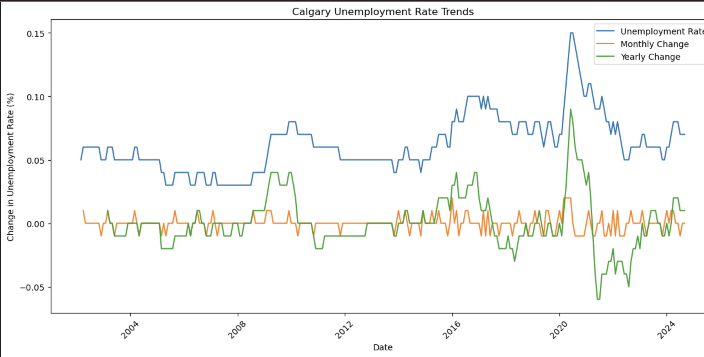
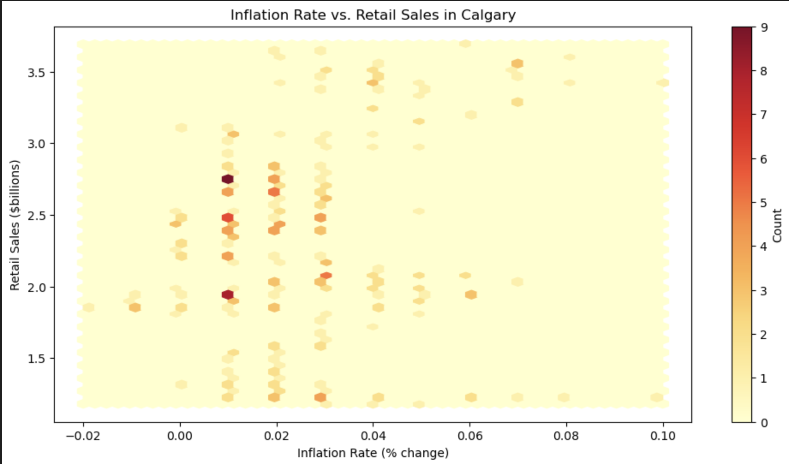
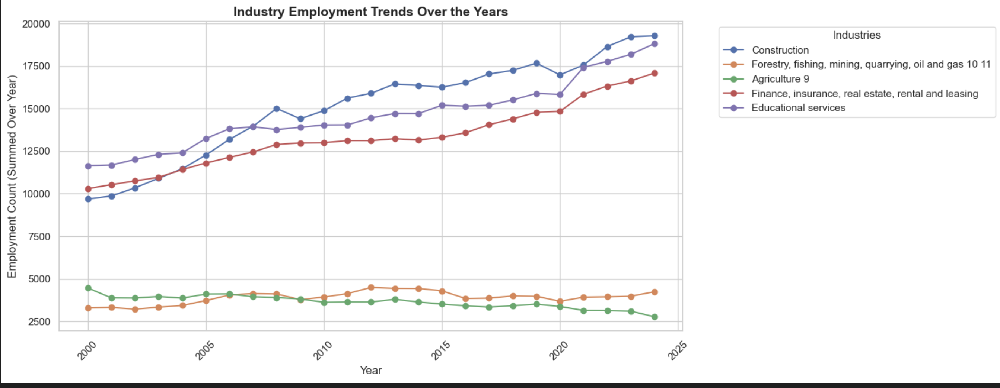
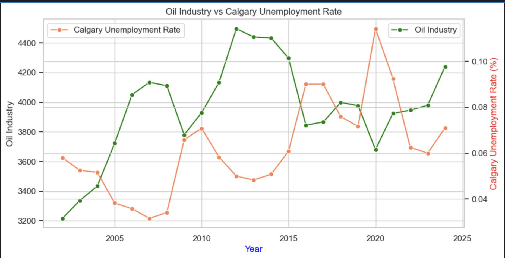

# Final-Report
Final written project topic: Economic shifts in Calgary

**Introduction**
Unemployment rate is an important indicator of measuring the economic health of Calgary. In 1997, statistics showed that Calgary with a 6.4 percent unemployment rate, was the lowest of the largest 25 metropolitan areas in Canada which made Calgary economy look appealing, thereby attracting people to come into the province, (“Where the Jobs Are, 1997). However, in recent times, Alberta now has a higher unemployment rate higher than the rest of the country at 7.5 percent while the others average at 6.8 percent (Stolte, 2024). Understanding these unemployment rates and trends are essential for developing effective policies and promoting economic resilience. Calgary is a city known for its close ties to the oil industry hence changes in employment rates within the sector could greatly affect unemployment rates in the city. For instance, due to the covid pandemic, there was a squeeze in the Canadian crude-oil prices. Canadian finance minister, warned local businesses about how the epidemic will have a significant impact on the energy sector putting more pressure on the city's struggling economy (Franson, 2020).
Data Sets
Unemployment rates, Population and Industries data sets were used.
**Guiding quesstion** 
1. How does Calgary's unemployment rate compare to the overall rate of Alberta and Canada. Understanding Calgary's unemployment rate relative to Alberta and Canada can reveal whether Calgary faces unique economic challenges or benefits that differ from broader trends.
   Graph
   
   When the unemployment figures are compared, it is apparent that unemployment rates in Calgary, Alberta, and Canada do follow each other. That convergence accounts for the fact that local Alberta labor market conditions in Calgary and statewide conditions are dictated by national trends. Whenever something happens at the national level—whether due to monetary policy changes, international market pressures, or some other factor—Calgary and Alberta move with it, demonstrating regional and national economy interdependence
2. What is the trend in Calgary's total unemployment rate on a month-to-month basis and a year-to-year basis?
   Graph
   
   The tight relationship between the unemployment rate and the change on a year-over-year basis is a reflection that longer-term, cumulative effects of economic dislocation are better reflected on an annual basis. In the periods when the unemployment rate spikes, the year-over-year change is a significant indicator of the degree of economic dislocation.
3. How is the inflation rate in Calgary affecting consumer spending through retail sales Data?
Graph
 
The point clustering to moderate inflation levels (0%-3%) suggests the existence of regular inflation rates occurring with consistent retail sales numbers. Since there is no steep correlation, the implication is inflation itself may not be a crucial factor determining Calgary retail sales. Other macroeconomic indicators such as interest rates, wages, employment, and consumer confidence are likely to exert a more profound influence on the pattern of retail spending.
4. Which industries show the highest growth or decline in employment levels?
  
Steady Growth in Construction, Finance and Educational services:
The lines in the graph above shows steady growth from 2000 to around 2010. Between 2010 - 2015 it can be seen that there was a rise in the employment levels in the construction, finance, educational services and forestry , mining employment levels.The rise in these employment levels led to increased investments in residential and non-resenditial buildings, public infrastructure and construction projects.
5. Is there a relationship between the oil industry employment rate and Calgary's unemployment Rate?
 
The graph tracks the oil industry employment pattern (green line) and the unemployment rate in Calgary (orange line) over time.There appears to be a negative correlation between the two variables: When the oil industry increases, the unemployment rate decreases.
When the oil industry declines, unemployment increases. This means that the oil sector has a direct influence on Calgary's labor market, making it a vital economic catalyst.

**Conclusion**
* Calgary's economy is heavily dependent on oil & gas, which makes it vulnerable to industry fluctuations.
* The COVID-19 pandemic caused a steep increase in unemployment but recovery has been sluggish.
* Inflation has minimal effect on retail sales, hence consumer spending is influenced by other economic factors.
* Policy intervention and diversification are necessary to achieve a more stable economy and labor market

**Future Takeaway**
* Reducing dependence on oil and diversifying into alternative sectors.
* Investment in re-skilling the workforce and training them to match evolving employment needs.
* Encouraging innovation and green economic policies for the creation of a balanced labor market.
* This detailed research unfolds Calgary's economic challenges and opportunities, offering thought-provoking information for policymakers, businesspersons, and analysts.

  
   
   

