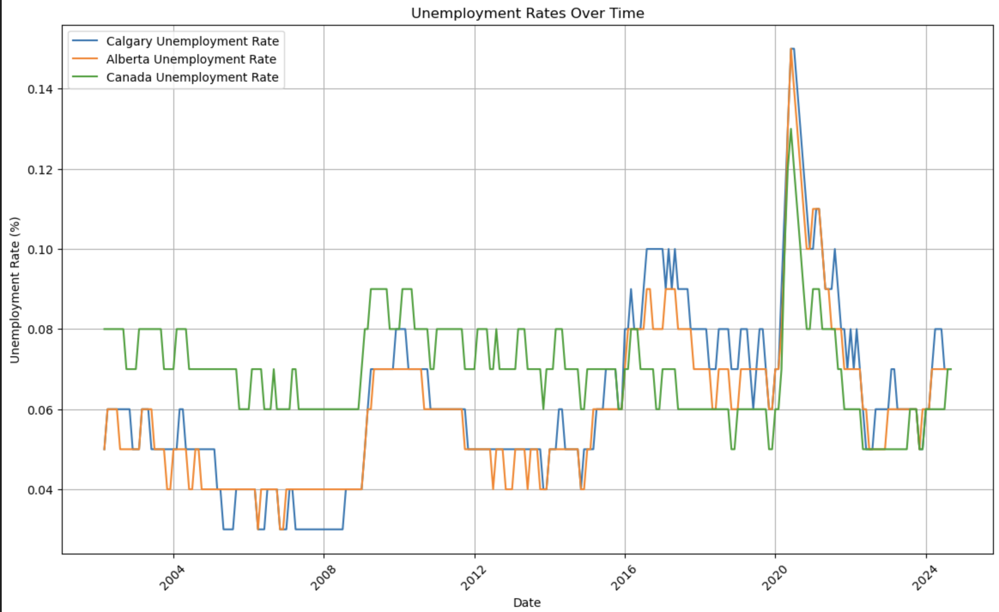

# Final-Report
Final written project topic: Economic shifts in Calgary
**Introduction**
Unemployment rate is an important indicator of measuring the economic health of Calgary. In 1997, statistics showed that Calgary with a 6.4 percent unemployment rate, was the lowest of the largest 25 metropolitan areas in Canada which made Calgary economy look appealing, thereby attracting people to come into the province, (“Where the Jobs Are, 1997). However, in recent times, Alberta now has a higher unemployment rate higher than the rest of the country at 7.5 percent while the others average at 6.8 percent (Stolte, 2024). Understanding these unemployment rates and trends are essential for developing effective policies and promoting economic resilience. Calgary is a city known for its close ties to the oil industry hence changes in employment rates within the sector could greatly affect unemployment rates in the city. For instance, due to the covid pandemic, there was a squeeze in the Canadian crude-oil prices. Canadian finance minister, warned local businesses about how the epidemic will have a significant impact on the energy sector putting more pressure on the city's struggling economy (Franson, 2020).
Data Sets
Unemployment rates, Population and Industries data sets were used.
**Guiding quesstion** 
1. How does Calgary's unemployment rate compare to the overall rate of Alberta and Canada. Understanding Calgary's unemployment rate relative to Alberta and Canada can reveal whether Calgary faces unique economic challenges or benefits that differ from broader trends.
   Graph
   
   
   

